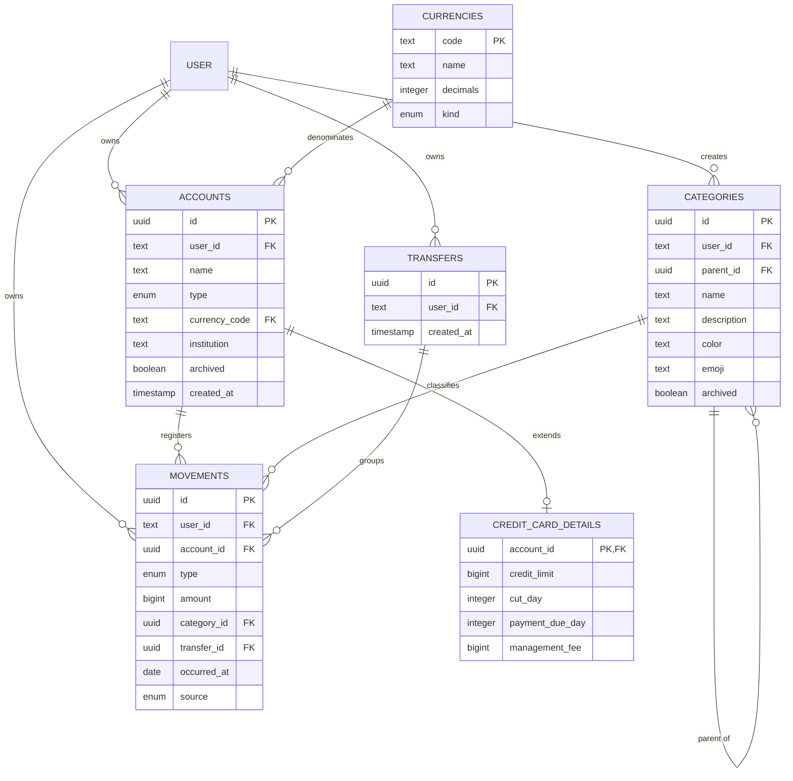

# Modelo de datos

Referencia del modelo implementado. La fuente exacta de columnas, constraints y
tipos es el código en `backend/src/**/*.schema.ts` y las migraciones en
`backend/src/infra/db/migrations/`.

Este documento describe qué entidades existen y cómo se relacionan. La
justificación de las decisiones estructurales vive en
`docs/architecture/adr/`.

## 1. Invariantes 

| Invariante                                                                 | ADR                                                               |
| -------------------------------------------------------------------------- | ----------------------------------------------------------------- |
| Montos como enteros positivos en unidades mínimas; el tipo define el signo | [ADR-001](architecture/adr/ADR-001-money-as-minor-units.md)       |
| El balance se deriva de movimientos y no se almacena en `accounts`         | [ADR-002](architecture/adr/ADR-002-derived-account-balances.md)   |
| Las transferencias agrupan movimientos atómicos                            | [ADR-003](architecture/adr/ADR-003-transfers-as-ledger-groups.md) |
| Una tarjeta es una cuenta extendida por detalles 1:1                       | [ADR-004](architecture/adr/ADR-004-credit-cards-as-accounts.md)   |
| Cada cuenta tiene una moneda; fiat y cripto comparten el modelo            | [ADR-005](architecture/adr/ADR-005-crypto-as-currencies.md)       |
| Categorías globales y propias usan una tabla y un nivel de jerarquía       | [ADR-006](architecture/adr/ADR-006-single-level-category-tree.md) |
| Ingresos/gastos son simples; las transferencias exigen cuadre              | [ADR-007](architecture/adr/ADR-007-pragmatic-double-entry.md)     |

Todas las tablas de dominio se limitan por `user_id` según la regla 8 de
`backend/ARCHITECTURE.md`. Las categorías del sistema son la única excepción de
visibilidad: usan `user_id = NULL` y se combinan con las categorías propias.

## 2. Entidades vigentes

### Autenticación

Better Auth posee estas tablas:

- `user`: identidad principal.
- `session`: sesiones activas y expiración.
- `account`: credenciales y cuenta del proveedor de autenticación.
- `verification`: tokens de verificación administrados por la librería.

Las tablas de dominio referencian `user.id` pero no modifican su estructura.

### Monedas y cuentas

- `currencies`: código, nombre, decimales y `kind = fiat | crypto`.
- `accounts`: nombre, tipo, moneda, institución opcional, propietario y estado
  archivado.
- Una cuenta tiene exactamente una `currency_code`.
- El nombre de una cuenta activa es único por usuario sin distinguir
  mayúsculas.
- `institution` es texto presentacional; no existe una tabla de instituciones.

### Tarjetas de crédito

- `credit_card_details` extiende 1:1 una cuenta `credit_card`.
- Guarda cupo, día de corte, día límite de pago y cuota de manejo opcional.
- Deuda, saldo a favor, cupo disponible y utilización se calculan desde el
  balance del ledger.
- Crear una tarjeta completa puede incluir deuda inicial como
  `adjustment_out` dentro de la misma transacción.

### Categorías

- `categories.user_id = NULL` identifica una categoría del sistema.
- Un `user_id` identifica una categoría creada por ese usuario.
- `parent_id = NULL` identifica una raíz; un valor identifica una
  subcategoría.
- El servicio permite un único nivel de hijos.
- Descripción, color y emoji son opcionales.
- Las categorías con historial se archivan.

### Movimientos y transferencias

- `movements` registra una afectación positiva sobre una cuenta; `type` define
  si suma o resta.
- Tipos: `income`, `expense`, `transfer_in`, `transfer_out`, `adjustment_in` y
  `adjustment_out`.
- `occurred_at` registra la fecha económica; `created_at`, la fecha de registro.
- `category_id` y `transfer_id` son opcionales según la operación.
- Las operaciones creadas por la API actual usan `source = manual`.
- `transfers` agrupa los movimientos de una transferencia y pertenece al mismo
  usuario.
- `/api/ledger` presenta cada grupo como una operación lógica antes de aplicar
  filtros y paginación.

## 3. Reglas derivadas

```text
balance = SUM(sign(type) * movement.amount)

debt = max(0, -balance)
creditBalance = max(0, balance)
availableCredit = max(0, creditLimit + balance)
utilization = debt / creditLimit * 100
```

- Un saldo inicial positivo usa `adjustment_in`; una deuda inicial usa
  `adjustment_out`.
- Pagar una tarjeta es una transferencia hacia su cuenta.
- Una compra o cuota registrada en tarjeta es un gasto sobre esa cuenta.
- En una transferencia FX se guardan ambos montos reales; la tasa se deriva.
- Cada comisión se registra como gasto en la cuenta y lado correspondientes.
- Archivar una cuenta o tarjeta exige balance cero.

## 4. Diagrama



El diagrama muestra los campos estructurales. Consultar los schemas Drizzle
para campos adicionales, defaults, índices y constraints exactos.
