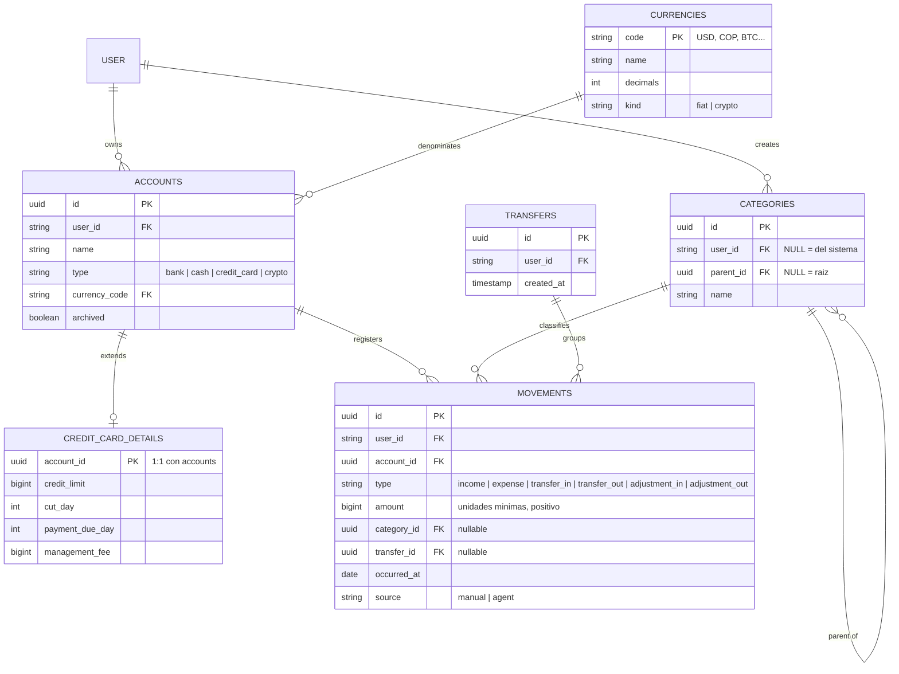

# DATABASE.md

Referencia de diseño del modelo de datos. **La fuente de verdad de columnas y tipos es el código** (`backend/src/**/*.schema.ts`); este documento explica las decisiones y sus porqués. Se actualiza cuando cambia una _decisión_, no cuando cambia una columna.

## Principios

1. **El dinero nunca es float.** Montos como enteros en unidades mínimas (`bigint`: centavos). Los decimales de cada moneda viven en la tabla `currencies`, no hardcodeados. Las funciones de cálculo operan sobre enteros.
2. **Los balances son derivados, nunca almacenados.** El balance de una cuenta = `SUM` de sus movimientos. Sin columna de balance que mantener sincronizada. Si algún día el agregado duele, se cachea — pero la fuente de verdad siempre es el ledger.
3. **Montos siempre positivos; el `type` da el signo.** `expense` de 50.000, no `-50000`. Más legible en queries y para las capabilities del agente.
4. **`occurred_at` ≠ `created_at`.** Cuándo ocurrió el hecho económico vs. cuándo se registró (el gasto de ayer registrado hoy).
5. **Todo movimiento registra su origen**: `source: manual | agent` (+ referencia a la conversación cuando es del agente). Auditoría del bot desde el día uno.
6. **Archivar, no borrar.** Cuentas y categorías con historial se archivan (`archived`). Coherente con la regla de "sin capabilities de delete" del agente.
7. **Toda tabla de dominio se scopea por `user_id`** (regla 9 de ARCHITECTURE.md). La tabla `user` la posee Better Auth (`infra/auth/`): se referencia por FK, nunca se modifica ni extiende — los datos de dominio del usuario van en tablas propias.

## Decisiones de diseño

### D1 — Una tarjeta de crédito es una cuenta, no un sistema aparte

**Decisión:** `accounts.type = 'credit_card'` + tabla satélite 1:1 `credit_card_details` (cupo, día de corte, día límite de pago, cuota de manejo). La deuda es el balance negativo de la cuenta; el cupo disponible = límite + balance; pagar la tarjeta es una transferencia hacia la cuenta-tarjeta; la cuota de manejo es un gasto recurrente.

**Descartado:** módulo/tablas independientes de tarjetas. Duplicaría el concepto de movimiento y rompería la propiedad "balance = agregado de movimientos".

**Reconsiderar si:** aparecen productos de crédito con lógica que no mapea a cuenta+movimientos (créditos con amortización, intereses compuestos calculados por el sistema).

### D2 — Transferencias como grupo de movimientos, no como tabla from/to

**Decisión:** cada movimiento pertenece a exactamente una cuenta. Una transferencia = registro en `transfers` + N movimientos enlazados por `transfer_id`: salida en la cuenta origen, entrada en la destino, y la comisión como movimiento de gasto propio.

**Por qué:** (a) el balance de cualquier cuenta sigue siendo `SUM(movements)` sin casos especiales; (b) en cambios de moneda se guardan **ambos montos reales** (lo que salió en COP, lo que entró en USD) — la tasa es derivada (`destino/origen`), nunca almacenada como fuente: guardar "monto + tasa" descuadra por redondeo; (c) la comisión queda como gasto de primera clase, consultable como cualquier gasto ("cuánto pagué en comisiones este año" es un query normal por categoría).

**Descartado:** tabla `transfers(from_account, to_account, amount, rate, fee)`. Rompe (a) y (b).

**Nota de roadmap:** esto elimina `commissions` como módulo — es una categoría + el vínculo al transfer.

### D3 — Cripto son monedas, no un módulo especial

**Decisión:** `currencies.kind = fiat | crypto`. Un wallet de BTC es una cuenta con `currency_code = 'BTC'` (`decimals: 8`). Comprar cripto con dólares es exactamente la misma operación que cambiar USD→COP: una transferencia entre cuentas de distinta moneda. El rendimiento del portafolio es una capa de **valoración** encima (tabla futura `asset_prices` con precios históricos vía API + costo base derivado del historial de transferencias), no un modelo de datos distinto.

**Descartado:** módulo cripto con sus propias tablas de holdings/trades. Duplicaría cuentas y movimientos.

**Límite conocido:** `bigint` en unidades mínimas soporta hasta 8 decimales cómodamente; monedas con 18 decimales nativos (ETH en wei) se registran a 8 decimales — precisión de sobra para tracking de portafolio personal.

**Corolario — una cuenta = una moneda, siempre.** Una plataforma con varios assets (ej. Binance con BTC, ETH y SOL) son varias cuentas: "Binance BTC", "Binance ETH", "Binance SOL". Nunca cuentas multi-moneda: romperían `balance = SUM(movements)` (unidades inconmensurables). Un swap dentro de la plataforma (USDT→SOL) es una transferencia normal (D2) entre esas cuentas — de ahí sale gratis el costo base para valoración. La agrupación "todo lo de Binance" es presentacional: campo opcional `institution` en accounts (texto libre), usado por frontend/bot/valoración para agrupar y totalizar.

### D4 — Categorías: una tabla, jerarquía de un nivel, sistema + propias

**Decisión:** tabla única con `parent_id` auto-referencial (el service valida un solo nivel: un padre no puede tener padre) y `user_id` **nullable**: `NULL` = categoría del sistema (visible para todos, no editable), con valor = categoría propia del usuario. El scoping se ajusta: "mis categorías" = `user_id = :me OR user_id IS NULL`.

**Descartado:** (a) tablas separadas categories/subcategories — misma entidad, más joins; (b) sembrar copias de las predefinidas por usuario — las del sistema evolucionan una sola vez y el agente puede confiar en ids estables para clasificar.

**Reconsiderar si:** se necesita más de un nivel de anidación (cambiar la validación, el modelo ya lo soporta).

### D5 — Partida doble pragmática, no contabilidad formal

**Decisión:** ingresos y gastos son entradas simples (movimiento + categoría); solo las transferencias exigen cuadre entre sus movimientos enlazados. No se modelan cuentas conceptuales de ingresos/gastos ni asientos débito/crédito.

**Por qué:** la partida doble real (todo suma cero, cada concepto es una cuenta) compra auto-verificación matemática y reportes contables formales, a cambio de complicar cada query, la UX y las capabilities del agente. Para finanzas personales, la parte valiosa es el cuadre de transferencias — y esa sí se tomó (D2). Es el modelo de los productos de finanzas personales estándar.

**Reconsiderar si:** el proyecto evoluciona a contabilidad de negocio (facturación, impuestos, auditoría) o multi-usuario con requisitos de integridad contable. Esa sería la migración grande del proyecto.

## Diagrama

Notas del diagrama: `USER` es la tabla de Better Auth (referenciada, no modificada — principio 7). `adjustment_in`/`adjustment_out` existen para el balance inicial de una cuenta (que puede ser deuda: tarjeta) y correcciones manuales — dos tipos porque el principio 3 exige montos positivos con el signo en el type. Los campos mostrados son los estructurales; el código puede tener campos adicionales (descripción, timestamps, etc.).

## Orden de construcción

| Spec        | Tablas                                                     | Nota                                                 |
| ----------- | ---------------------------------------------------------- | ---------------------------------------------------- |
| SPEC-001 ✅ | `user`, `session`, `account`, `verification` (Better Auth) | Identidad                                            |
| SPEC-002 ✅ | `categories`                                               | Estrena el patrón de módulo de dominio               |
| SPEC-003 ✅ | `currencies` (seed USD, COP) + `accounts`                  | Sin satélite de tarjeta todavía                      |
| SPEC-004 ✅ | `movements` + `transfers`                                  | El corazón: ledger, FX, comisiones, funciones puras  |
| SPEC-005 ✅ | `credit_card_details`                                      | Satélite 1:1 + lógica de corte/pago                  |
| SPEC-005 ✅ | monedas crypto (seed)                                      | BTC, ETH, SOL y USDT; sin valoración todavía         |
| Futuro      | `asset_prices`                                             | Valoración de portafolio; precios vía adapter de API |

Propiedad que valida el diseño: las extensiones futuras **agregan** tablas y filas — no modifican las existentes. Si un spec futuro necesita alterar `movements` o `accounts` estructuralmente, revisar primero si la decisión correspondiente (D1–D5) sigue vigente.
